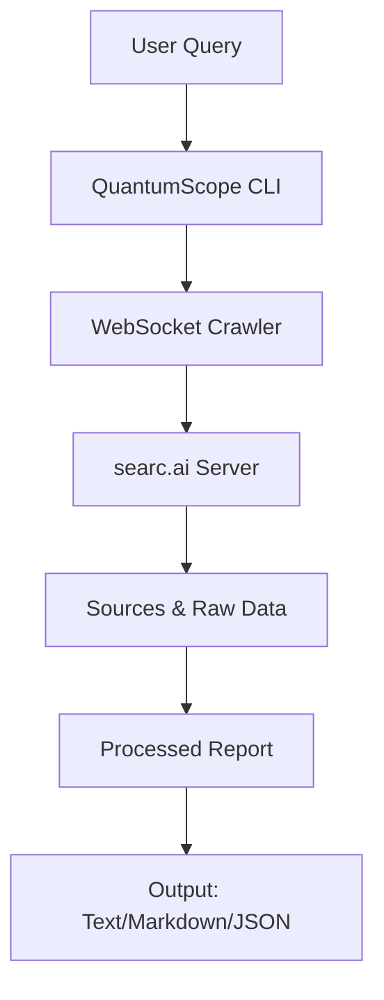

# QuantumScope 🚀

**QuantumScope** is a powerful CLI tool for AI-powered research and report generation, designed for researchers, developers, and professionals. Powered by a real-time WebSocket crawler, it delivers fast, customizable research reports with sources and downloadable files. Whether you're digging into academic papers, industry trends, or cutting-edge tech, QuantumScope streamlines your research workflow.

> **Note**: This is the raw, production-ready version of QuantumScope. Stay tuned for epic AI enhancements coming soon! 💪


[](https://pypi.org/project/QuantumScope/)
[](https://pypi.org/project/QuantumScope/)
[](https://github.com/xenarcai/QuantumScope/blob/main/LICENSE)
[](https://discord.gg/BBMdTZrpzX)

---

## ✨ Features

| Feature | Description |
|---------|-------------|
| **Real-Time Research** | Streams results via WebSocket from `searc.ai` for instant insights. |
| **Customizable Reports** | Choose Summary, Multi-Agent, or Detailed reports with tones like Objective or Formal. |
| **Interactive Mode** | Run multiple queries with a dynamic CLI prompt for iterative research. |
| **Output Formats** | Save reports as `text`, `markdown`, or `json` for easy integration. |
| **Domain Filtering** | Focus searches on specific domains (e.g., `arxiv.org`, `nature.com`). |
| **Robust Error Handling** | Gracefully handles interruptions, timeouts, and server issues. |

---

## 🛠️ Installation

```bash
pip install QuantumScope
```

**Requirements**:
- Python 3.8+
- Dependencies: `websockets`, `aiohttp` (auto-installed via `pip`)

**Verify Installation**:
```bash
QuantumScope --version
```

---

## 🚀 Quick Start

Run a research query in one line:
```bash
QuantumScope "impact of AI on climate change mitigation"
```

Want a detailed report with a formal tone?
```bash
QuantumScope -t detailed -o formal "latest trends in quantum machine learning"
```

Filter by specific domains:
```bash
QuantumScope --domains arxiv.org nature.com "CRISPR gene editing ethics"
```

Save output as Markdown:
```bash
QuantumScope "Python web frameworks" --output report.md --format markdown
```

Enter interactive mode:
```bash
QuantumScope --interactive
```

---

## 📈 How It Works

QuantumScope connects to a WebSocket server (`wss://searc.ai/ws`) to stream research data in real time. The CLI processes results into reports, sources, and downloadable files, with a colorful interface for a smooth experience.



---

## 🎮 Usage Guide

### **Basic Commands**

| Option | Description | Example |
|--------|-------------|---------|
| `-t, --type` | Report type: `summary`, `multi_agents_report`, `research_report` | `-t detailed` |
| `-o, --tone` | Tone: `objective`, `formal`, `analytical`, `persuasive`, `informative` | `-o formal` |
| `-d, --domains` | Filter by domains | `--domains arxiv.org nature.com` |
| `--no-logs` | Disable real-time logs | `--no-logs` |
| `-i, --interactive` | Interactive mode | `--interactive` |
| `--config` | Configure defaults | `--config` |
| `-O, --output` | Save report to file | `--output report.md` |
| `--format` | Format: `text`, `markdown`, `json` | `--format markdown` |
| `-v, --version` | Show version | `--version` |

**Example Output**:
```
🚀 QuantumScope Research Initiated: impact of AI on climate change mitigation
   Report: summary | Tone: Objective | Domains: Any
   Powered by QuantumScope AI Intelligence
📤 Connecting to QuantumScope Intelligence...
✅ Connected! AI agents are now researching...
======================================================================
🔗 Sources (3):
  1. https://www.nature.com/articles/s41560-021-00827-6
  2. https://arxiv.org/abs/2104.05123
  3. https://www.un.org/en/climatechange/ai-climate-solutions
⏬ Download Links:
  🔗 PDF: https://searc.ai/reports/ai_climate_123.pdf
📋 Report Text Preview:
AI is transforming climate change mitigation by optimizing energy systems...
======================================================================
```

### **Interactive Mode**

```bash
QuantumScope --interactive
```

**Commands**:
| Command | Description | Example |
|---------|-------------|---------|
| `<query>` | Run a query | `AI in healthcare` |
| `set type <type>` | Set report type | `set type summary` |
| `set tone <tone>` | Set tone | `set tone analytical` |
| `set domains <d1,d2>` | Set domains | `set domains arxiv.org,sciencemag.org` |
| `set logs <on/off>` | Toggle logs | `set logs off` |
| `config` | Configure defaults | `config` |
| `help` | Show help | `help` |
| `quit` | Exit | `quit` |

**Example Session**:
```
QuantumScope (summary/Objective)> AI in healthcare
🚀 QuantumScope Research Initiated: AI in healthcare
...
QuantumScope (summary/Objective)> set type detailed
Report type set to: research_report
QuantumScope (research_report/Objective)> quit
👋 Exiting Interactive Mode. Goodbye!
```

### **Configuration**

Set defaults:
```bash
QuantumScope --config
```

**Options**:
1. **Report Type**: `1` (Summary), `2` (Multi-Agent), `3` (Detailed)
2. **Tone**: `1` (Objective), `2` (Formal), etc.
3. **Show Logs**: `yes`/`no`

Settings saved to `~/.QuantumScope/config.json`.

### **Output Formats**

| Format | Description | Example |
|--------|-------------|---------|
| `text` | Plain text with sources/links | `report.txt` |
| `markdown` | Formatted with headers | `report.md` |
| `json` | Full metadata | `report.json` |

**Markdown Example**:

# QuantumScope Research Report

**Query:** `AI in healthcare`
**Report Type:** summary
**Tone:** Objective
**Generated:** 2025-06-02 16:51:23 IST
**Duration:** 12.34 seconds

## 📚 Sources
1. <https://www.nature.com/articles/s41591-021-01336-3>
2. <https://arxiv.org/abs/2005.12345>

## 📄 Repo Text
```text
AI is revolutionizing healthcare through diagnostics...
```
---

## 🎉 CLI Animation

Simulated CLI progress:

🚀 Researching... [⠋] 
🚀 Researching... [⠙] 
🚀 Researching... [⠹] 
✅ Done!


---

## 🛡️ Error Handling

Handles:
- **WebSocket Errors**: Reconnects up to 6 times.
- **Timeouts**: Exits after 120s inactivity.
- **Interrupts**: Saves partial results on `Ctrl+C`.
- **Invalid Queries**: Prompts for valid input.

**Example Error**:
`
❌ WebSocket Connection Error: Server unavailable at wss://searc.ai/ws

## 📊 Performance

| Metric | Value |
|--------|-------|
| **Query Time** | ~10-30s (depends on report type) |
| **Max Sources** | 15 displayed, unlimited stored |
| **Max Report Size** | Streamed, no limit |
| **Timeout** | 120s (configurable) |

---

## 🐛 Troubleshooting

| Issue | Solution |
|-------|----------|
| WebSocket fails | Check internet or try later. Ensure `wss://searc.ai/ws` is up. |
| No report generated | Use `--no-logs` to debug or try another query. |
| Config errors | Delete `~/.QuantumScope/config.json` and rerun `--config`. |

---

## 📚 Documentation

- **API Reference**: Coming soon on [ReadTheDocs](https://QuantumScope.readthedocs.io/) (WIP)
- **Contributing**: See [CONTRIBUTING.md](#) (TBD)
- **Issues**: [GitHub Issues](https://github.com/xenarcai/QuantumScope/issues)

---

## 🤝 Community

- **Discord**: [Join us!](https://discord.gg/BBMdTZrpzX)
- **GitHub**: [Star & Fork](https://github.com/xenarcai/QuantumScope)
- **Email**: [team@xenarcai.com](mailto:team@xenarcai.com)

---

## 🛡️ License

MIT License. See [LICENSE](./LICENSE).

---

**Developed by Parvesh Rawal @ XenArcAI**  
*QuantumScope v1.0.2 | Ready for the future of AI research

---
