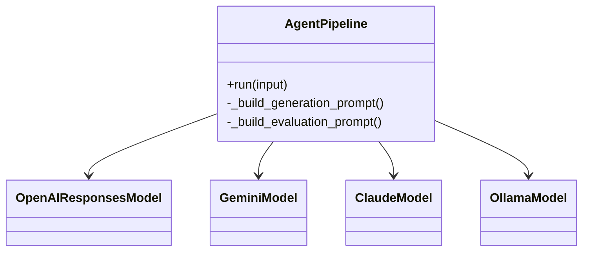

# APIリファレンス

このページでは、mkdocstringsプラグインを使用して`agents_sdk_models`パッケージのAPIリファレンスを自動生成します。

::: agents_sdk_models

## クラス・関数一覧

| 名前                     | 種別     | 概要                                                        |
|--------------------------|----------|-------------------------------------------------------------|
| get_llm                  | 関数     | モデル名・プロバイダー名からLLMインスタンスを取得           |
| AgentPipeline            | クラス   | 生成・評価・ツール・ガードレールを統合したパイプライン     |
| ConsoleTracingProcessor  | クラス   | コンソール色分けトレース出力用プロセッサ                   |
| enable_console_tracing   | 関数     | コンソールトレーシングを有効化                             |
| disable_tracing          | 関数     | トレーシング機能をすべて無効化                             |
| OpenAIResponsesModel     | クラス   | OpenAI用モデルラッパー                                      |
| GeminiModel              | クラス   | Google Gemini用モデルラッパー                               |
| ClaudeModel              | クラス   | Anthropic Claude用モデルラッパー                           |
| OllamaModel              | クラス   | Ollama用モデルラッパー                                      |

---

## get_llm
- モデル名・プロバイダー名からLLMインスタンスを返すファクトリ関数

- 引数:
    - model (str): モデル名
    - provider (str, optional): プロバイダー名（省略時は自動推論）
    - temperature (float, optional): サンプリング温度
    - api_key (str, optional): プロバイダーAPIキー
    - base_url (str, optional): プロバイダーAPIベースURL
    - thinking (bool, optional): Claudeモデル思考モード
    - tracing (bool, optional): Agents SDK トレーシング有効化
- 戻り値: LLMインスタンス

### 引数
| 名前       | 型                 | 必須/オプション | デフォルト | 説明                                          |
|------------|--------------------|----------------|------------|-----------------------------------------------|
| model      | str                | 必須           | -          | 使用するLLMモデル名                           |
| provider   | str (optional)     | オプション     | None       | モデルのプロバイダー名（自動推論可）          |
| temperature| float (optional)   | オプション     | 0.3        | サンプリング温度                              |
| api_key    | str (optional)     | オプション     | None       | プロバイダーAPIキー                          |
| base_url   | str (optional)     | オプション     | None       | プロバイダーAPIベースURL                     |
| thinking   | bool (optional)    | オプション     | False      | Claudeモデルの思考モード                      |
| tracing    | bool (optional)    | オプション     | False      | Agents SDKのトレーシングを有効化するか        |

### 戻り値
`LLMインスタンス`

## enable_console_tracing
- コンソールトレーシング（`ConsoleTracingProcessor`）を有効化します。
- 引数: なし
- 戻り値: なし

## disable_tracing
- 全てのトレーシング機能（SDKおよびコンソール）を無効化します。
- 引数: なし
- 戻り値: なし

## AgentPipeline
- 生成・評価・ツール・ガードレールを統合したパイプライン管理クラス
- 主な引数:
    - name (str): パイプライン名
    - generation_instructions (str): 生成用プロンプト
    - evaluation_instructions (str, optional): 評価用プロンプト
    - model (str or LLM): 使用するモデル
    - evaluation_model (str or LLM, optional): 評価に使用するモデル名またはLLMインスタンス（省略時は`model`を使用）
    - generation_tools (list, optional): 生成時ツール
    - input_guardrails/output_guardrails (list, optional): 入出力ガードレール
    - threshold (int): 評価閾値
    - retries (int): リトライ回数
    - retry_comment_importance (list[str], optional): 重要度指定
- 主なメソッド:
    - run(input): 入力に対して生成・評価・自己改善を実行
- 戻り値: 生成・評価結果

### 引数
| 名前                    | 型                                    | 必須/オプション | デフォルト        | 説明                                      |
|-------------------------|---------------------------------------|----------------|-------------------|-------------------------------------------|
| name                    | str                                   | 必須           | -                 | パイプライン名                            |
| generation_instructions | str                                   | 必須           | -                 | 生成用システムプロンプト                  |
| evaluation_instructions | str (optional)                        | オプション     | None              | 評価用システムプロンプト                  |
| model                   | str or LLM                            | オプション     | None              | 使用するLLMモデル名またはLLMインスタンス |
| evaluation_model        | str or LLM                            | オプション     | None              | 評価に使用するモデル名またはLLMインスタンス（省略時はmodelを使用） |
| generation_tools        | list (optional)                       | オプション     | []                | 生成時に使用するツールのリスト            |
| evaluation_tools        | list (optional)                       | オプション     | []                | 評価時に使用するツールのリスト            |
| input_guardrails        | list (optional)                       | オプション     | []                | 生成時の入力ガードレールリスト            |
| output_guardrails       | list (optional)                       | オプション     | []                | 評価時の出力ガードレールリスト            |
| routing_func            | Callable (optional)                   | オプション     | None              | 出力ルーティング用関数                    |
| session_history         | list (optional)                       | オプション     | []                | セッション履歴                            |
| history_size            | int                                   | オプション     | 10                | 履歴保持数                                |
| threshold               | int                                   | オプション     | 85                | 評価スコアの閾値                          |
| retries                 | int                                   | オプション     | 3                 | リトライ試行回数                          |
| improvement_callback    | Callable[[Any, EvaluationResult], None] (optional)| オプション | None      | 改善提案用コールバック                    |
| dynamic_prompt          | Callable[[str], str] (optional)      | オプション     | None              | 動的プロンプト生成関数                    |
| retry_comment_importance| list[str] (optional)                 | オプション     | []                | リトライ時にプロンプトに含めるコメント重大度|

### 戻り値
`生成・評価結果（`EvaluationResult` を含むオブジェクト）`

## モデルラッパークラス
| クラス名                | 概要                       |
|------------------------|----------------------------|
| OpenAIResponsesModel   | OpenAI API用               |
| GeminiModel            | Google Gemini API用        |
| ClaudeModel            | Anthropic Claude API用     |
| OllamaModel            | Ollama API用               |

---

## クラス図（mermaid）

