<h1 align="center">AI-SDLC CLI</h1>
<p align="center">
  <strong>Markdown-driven software-lifecycle powered by AI agents</strong>
</p>

<p align="center">
  <a href="https://pypi.org/project/ai-sdlc/"></a>
  <a href="https://github.com/ParkerRex/ai-sdlc/blob/main/LICENSE"></a>
  <a href="https://python.org"></a>
  <a href="https://github.com/ParkerRex/ai-sdlc"></a>
</p>

<p align="center">
  <code>uv pip install ai-sdlc</code>
</p>

<p align="center">
  
</p>

## 📋 Table of Contents

### 🚀 Getting Started

- [What is AI-SDLC?](#-what-is-ai-sdlc)
- [Quick Start](#-quick-start)
- [Installation](#-installation)

### 📖 Usage & Workflow

- [Basic Workflow](#-basic-workflow)
- [Command Reference](#-command-reference)
- [How It Works](#️-how-it-works)

### 🏗️ Technical Details

- [Project Structure](#️-project-structure)
- [Architecture](#️-architecture)
- [Technology Stack](#-technology-stack)

### 🛠️ Development

- [Development Setup](#️-development-setup)
- [Testing & Quality](#-testing--quality)
- [Contributing](#-contributing)

### 📚 Resources

- [Troubleshooting](#-troubleshooting)
- [Roadmap](#️-roadmap)
- [License](#-license)

---

## 🤖 What is AI-SDLC?

AI-SDLC transforms software development into a **structured, AI-assisted workflow** that takes you from initial idea to production-ready code through 8 carefully designed steps.

### ✨ Key Features

- **🎯 Structured Workflow**: 8-step process from idea → PRD → architecture → tasks → tests
- **🤖 AI-Powered**: Leverages AI agents for automated processing and iteration
- **📝 Markdown-Driven**: Everything lives in version-controlled markdown files
- **🔄 Iterative**: Built-in support for refining ideas and requirements with AI chat
- **🚀 Production-Ready**: Generates comprehensive task lists and test plans
- **📦 Zero Config**: Works out of the box with sensible defaults

### 💡 Why AI-SDLC?

Traditional development often jumps straight to coding, missing crucial planning steps. AI-SDLC ensures you:

- ✅ **Never skip important planning phases**
- ✅ **Document decisions and rationale**
- ✅ **Generate comprehensive implementation plans**
- ✅ **Create thorough test strategies**
- ✅ **Maintain project history in version control**

---

## 🚀 Quick Start

Get up and running with AI-SDLC in under 2 minutes:

### 1️⃣ Install Dependencies

```bash
# Install uv (fast Python package manager)
curl -LsSf https://astral.sh/uv/install | sh

# Install AI-SDLC
uv pip install ai-sdlc
```

### 2️⃣ Initialize Your Project

```bash
# Create a new directory or use existing project
mkdir my-awesome-project && cd my-awesome-project

# Initialize AI-SDLC
aisdlc init
```

### 3️⃣ Start Your First Feature

```bash
# Create a new feature
aisdlc new "Add user authentication system"

# Check your progress
aisdlc status
```

### 4️⃣ Follow the Workflow

1. **Fill out the generated markdown** in `doing/add-user-authentication-system/0-idea-*.md`
2. **Run `aisdlc next`** to generate an AI prompt for the next step
3. **Use the prompt** with your preferred AI tool (Claude, ChatGPT, Cursor, etc.) and save the response
4. **Repeat** until all 8 steps are complete
5. **Archive** with `aisdlc done`

> 💡 **Tip**: AI-SDLC works with any AI tool - use your favorite AI assistant!

### 🎯 Flexible Usage

**Option 1: Full CLI Workflow** - Use the complete workflow with `aisdlc` commands that generate prompts for your AI tool

**Option 2: Prompts Only** - Just use the prompt templates manually with your preferred AI tool:

- Copy prompts from `prompts/` directory
- Use with any AI chat interface (Cursor, Claude, ChatGPT, etc.)
- Perfect for one-off projects or custom workflows

---

## 📦 Installation

### Prerequisites

| Tool                 | Install (macOS example)                                      |
| -------------------- | ------------------------------------------------------------ |
| Python 3.13+         | `brew install python@3.13` or `pyenv install 3.13.0`         |
| **uv**               | `curl -LsSf https://astral.sh/uv/install \| sh`              |
| AI Editor (optional) | Cursor, VS Code with AI extensions, or any AI chat interface |

### Install AI-SDLC

```bash
# Option 1: Using uv (recommended)
uv pip install ai-sdlc

# Option 2: Using pip
pip install ai-sdlc

# Verify installation
aisdlc --help
```

---

## 📖 Basic Workflow

The AI-SDLC workflow follows an 8-step process from idea to tests:



### 🎯 Workflow Modes

| Mode               | Steps | Description                         | Best For                                   |
| ------------------ | ----- | ----------------------------------- | ------------------------------------------ |
| **💬 Chat Mode**   | 1-5   | Interactive iteration with AI chat  | Refining ideas, requirements, architecture |
| **📝 Manual Mode** | 6     | Fill out markdown manually          | Creating detailed task lists               |
| **🤖 Agent Mode**  | 7-8   | Automated processing with AI agents | Task review, test generation               |

### 📋 Step-by-Step Process

1. **Initialize project**: `aisdlc init`
2. **Start new feature**: `aisdlc new "Your feature idea"`
3. **Progress through steps**: `aisdlc next` (repeat for each step)
4. **Check status**: `aisdlc status`
5. **Complete feature**: `aisdlc done`

## 📋 Command Reference

| Command             | Description                             | Example                                |
| ------------------- | --------------------------------------- | -------------------------------------- |
| `aisdlc init`       | Initialize AI-SDLC in current directory | `aisdlc init`                          |
| `aisdlc new <idea>` | Start new feature with idea description | `aisdlc new "Add user authentication"` |
| `aisdlc next`       | Progress to next step in workflow       | `aisdlc next`                          |
| `aisdlc status`     | Show current project status             | `aisdlc status`                        |
| `aisdlc done`       | Archive completed feature to done/      | `aisdlc done`                          |
| `aisdlc --help`     | Show help information                   | `aisdlc --help`                        |

**Working with steps:**

- Each step creates a markdown file in `doing/<feature-slug>/`
- Fill out the generated markdown before running `aisdlc next`
- AI agents process your input and generate the next step
- **Alternative**: Use prompt templates directly with any AI chat interface

---

## ⚙️ How It Works

```mermaid
flowchart TD
    I[01-idea]-->P1[02-prd]-->P2[03-prd-plus]-->A[04-architecture]
    A-->SP[05-system-patterns]-->T[06-tasks]-->TP[07-tasks-plus]-->TESTS[08-tests]

    %% Iteration loop for steps 1-5
    CHAT[💬 Iterate with AI Chat]
    I -.-> CHAT
    P1 -.-> CHAT
    P2 -.-> CHAT
    A -.-> CHAT
    SP -.-> CHAT
    CHAT -.-> I
    CHAT -.-> P1
    CHAT -.-> P2
    CHAT -.-> A
    CHAT -.-> SP

    %% Agent mode for steps 7-8
    AGENT[🤖 Use AI Agent Mode]
    TP --- AGENT
    TESTS --- AGENT
```


**Workflow modes explained:**

- **Steps 1-5 (💬 Chat Mode)**: You manually fill out markdown files and iterate with AI chat to refine your ideas, requirements, and architecture
- **Step 6 (Tasks)**: Manual step to create implementation tasks
- **Steps 7-8 (🤖 Agent Mode)**: Automated processing using AI agents for task review and test generation

**Running `aisdlc next`:**

1. Reads the previous markdown file
2. Merges it into the prompt for the next step
3. For steps 7-8: Calls **AI agent** (requires compatible AI editor or API)
4. Writes the new markdown and bumps `.aisdlc.lock`

**Using prompts manually:**

1. Copy the appropriate prompt from `prompts/` directory
2. Paste your previous step's content into the `<prev_step>` placeholder
3. Use with any AI chat interface (Cursor, Claude, ChatGPT, etc.)
4. Save the output as the next step's markdown file

---

## 🏗️ Project Structure

```text
.
├── ai_sdlc/                # main Python package
│   ├── cli.py              # entry point for `aisdlc`
│   ├── commands/           # sub-commands: init | new | next | status | done
│   ├── scaffold_template/  # default templates for new projects
│   └── utils.py            # shared helpers
├── prompts/                # LLM templates for each SDLC step
│   ├── 0.idea.instructions.md   # initial idea analysis
│   ├── 1.prd.instructions.md    # product requirements
│   ├── 2.prd-plus.instructions.md # enhanced requirements
│   ├── 3.system-template.instructions.md # system architecture
│   ├── 4.systems-patterns.instructions.md # design patterns
│   ├── 5.tasks.instructions.md  # implementation tasks
│   ├── 6.tasks-plus.instructions.md # task list review & handoff preparation
│   └── 7.tests.instructions.md         # test generation
├── tests/                  # pytest suite (unit + integration)
│   ├── unit/               # unit tests
│   └── integration/        # integration tests
├── doing/                  # active features (created by init)
├── done/                   # completed features (created by init)
├── .aisdlc                 # TOML config (ordered steps, dirs, diagram)
├── .aisdlc.lock           # current workflow state
├── pyproject.toml          # build + dependency metadata
├── CHANGELOG.md            # version history
└── README.md               # you are here
```

---

## 🏛️ Architecture

AI-SDLC is built around a simple but powerful concept: **markdown-driven development with AI assistance**.

### Core Components

1. **CLI Interface** (`ai_sdlc/cli.py`)

   - Entry point for all commands
   - Handles argument parsing and command routing

2. **Command System** (`ai_sdlc/commands/`)

   - Modular command structure
   - Each command handles a specific workflow step

3. **Prompt Templates** (`prompts/`)

   - LLM prompts for each SDLC step
   - Structured to guide AI through development process

4. **State Management**
   - `.aisdlc` - Project configuration
   - `.aisdlc.lock` - Current workflow state
   - File-based state tracking

### Workflow Engine

The workflow engine processes each step by:

1. Reading the previous step's output
2. Merging it with the appropriate prompt template
3. Calling Cursor agent to generate next step
4. Writing output and updating state

## 🔧 Technology Stack

| Layer          | Main libs / tools                                | Why                                    |
| -------------- | ------------------------------------------------ | -------------------------------------- |
| CLI            | **Python 3.13**, `click`-style argparse (stdlib) | modern syntax, zero deps runtime       |
| Package mgmt   | **uv**                                           | fast, lock-file driven reproducibility |
| Dev tooling    | **Ruff**, **Pyright**, **pytest**                | lint + format, type-check, tests       |
| AI Integration | **Pluggable AI agents**                          | works with any AI editor or API        |
| Packaging      | `setuptools`, PEP 621 metadata                   | slim install                           |

### `pyproject.toml` excerpt

```toml
[project]
name = "ai-sdlc"
requires-python = ">=3.13.0"

[project.optional-dependencies]
dev = [
  "pytest>=7.0",
  "pytest-mock>=3.0",
  "ruff>=0.0.292",
  "pyright>=1.1.350"
]
```

---

## 🛠️ Development Setup

### Prerequisites

| Tool                 | Install (macOS example)                                   |
| -------------------- | --------------------------------------------------------- |
| Python 3.13+         | `brew install python@3.13` or `pyenv install 3.13.0`      |
| **uv**               | `curl -LsSf https://astral.sh/uv/install \| sh`           |
| AI Editor (optional) | Cursor, VS Code with AI extensions, or any AI interface   |
| Node 20 + pnpm\*     | `brew install node pnpm` _(only if you touch TS helpers)_ |

### Setup

```bash
git clone https://github.com/your-org/ai-sdlc.git
cd ai-sdlc
uv venv && source .venv/bin/activate
uv sync --all-features        # installs runtime + dev deps from uv.lock
pre-commit install            # optional hooks
```

## 🧪 Testing & Quality

```bash
# install dev extras
uv pip install -e .[dev]

# lint + format
uv run ruff check ai_sdlc tests
uv run ruff format ai_sdlc tests

# type-check
uv run pyright

# run all tests
uv run pytest

# run specific test types
uv run pytest tests/unit/      # unit tests only
uv run pytest tests/integration/  # integration tests only
```

Integration tests spin up a temp project dir and exercise the CLI flow.

---

## 🔧 Troubleshooting

### Common Issues

**"AI agent command not found"**

- AI-SDLC generates prompts that work with any AI tool
- No specific AI tool installation required
- Use the generated prompts with your preferred AI assistant

**"Permission denied" errors**

- Check file permissions in your project directory
- Ensure you have write access to the current directory

**"Invalid .aisdlc configuration"**

- Verify your `.aisdlc` file has valid TOML syntax
- Run `aisdlc init` to regenerate default configuration

**"Lock file corruption"**

- Delete `.aisdlc.lock` and run `aisdlc status` to regenerate
- The tool handles corrupted lock files gracefully

### Getting Help

1. Check the command help: `aisdlc --help` or `aisdlc <command> --help`
2. Review the [CHANGELOG.md](CHANGELOG.md) for recent changes
3. Open an issue on GitHub with:
   - Your OS and Python version
   - Full error message
   - Steps to reproduce

---

## 🗺️ Roadmap

### Planned Features

- [ ] **Pluggable AI providers** – flag `--model` to swap GPT-4o, Claude, Gemini, etc.
- [ ] **09-release-plan** step (CI/CD & deployment playbook)
- [ ] **Context-window management** (summaries / embeddings for large projects)
- [ ] **Repomix integration** for giant monorepos
- [ ] **Template customization** - custom prompt templates per project
- [ ] **Parallel workflows** - multiple features in development simultaneously
- [ ] **Enhanced AI provider integrations** (OpenAI API, Anthropic API, etc.)

### Future Considerations

- Web UI for workflow visualization
- Team collaboration features
- Metrics and analytics for development velocity
- Integration with project management tools

---

## 🤝 Contributing

We welcome contributions! Here's how to get started:

### Development Workflow

1. **Fork and clone** the repository
2. **Create a feature branch**: `git checkout -b feat/your-feature`
3. **Make your changes** with tests
4. **Run quality checks**: `ruff check`, `pyright`, `pytest` must pass
5. **Open a PR** with a clear description

### Code Standards

- Follow existing code style (enforced by Ruff)
- Add tests for new functionality
- Update documentation for user-facing changes
- Keep commits atomic and well-described

### Areas for Contribution

- **Bug fixes** - Check GitHub issues
- **Documentation** - Improve clarity and examples
- **Testing** - Expand test coverage
- **Features** - See roadmap above
- **Prompt engineering** - Improve LLM prompt templates

---

## 📄 License

MIT © 2025 Parker Rex
See [LICENSE](LICENSE) for details.

---
