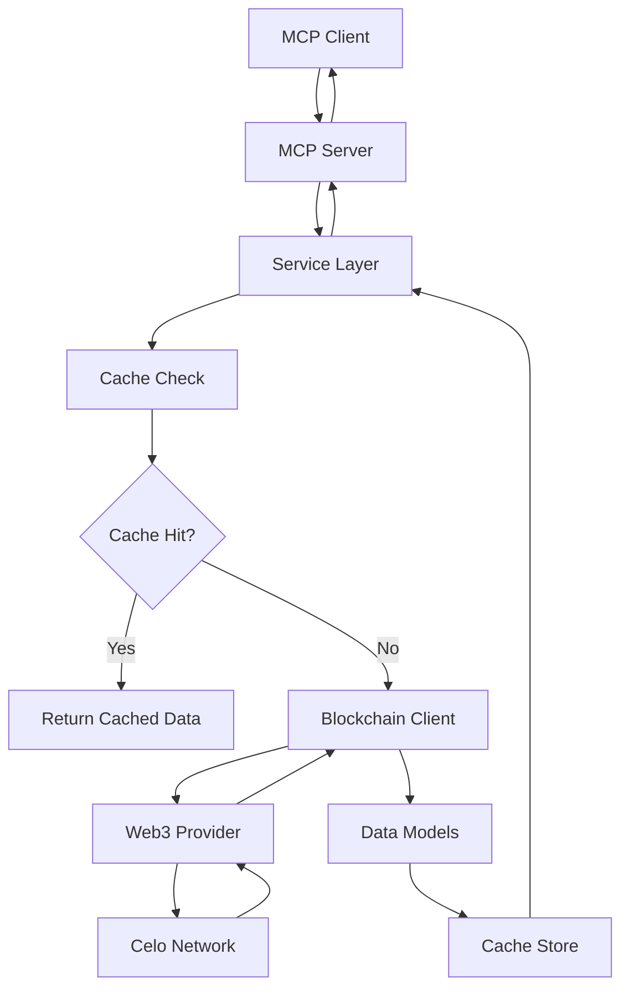

# Celo MCP Server Architecture

## Overview

The Celo MCP Server is a modular, production-ready Python backend that exposes Celo blockchain data and functionality via the Model Context Protocol (MCP). It's designed to be deployable via PyPI and usable with UVX for easy integration into AI applications.

## Architecture Principles

- **Modular Design**: Each feature is encapsulated in its own module with clear interfaces
- **Async-First**: Built with asyncio for high performance and scalability
- **Type Safety**: Comprehensive type hints and Pydantic models for data validation
- **Caching**: Built-in caching layer for improved performance
- **Configuration**: Environment-based configuration with sensible defaults
- **Testability**: Comprehensive test suite with unit and integration tests

## Project Structure

```
celo-mcp/
├── src/celo_mcp/                   # Main package
│   ├── __init__.py                 # Package exports
│   ├── server.py                   # MCP server implementation
│   ├── blockchain_data/            # Blockchain data access module
│   │   ├── __init__.py
│   │   ├── client.py              # Low-level Celo blockchain client
│   │   ├── models.py              # Pydantic data models
│   │   └── service.py             # High-level service layer
│   ├── config/                     # Configuration management
│   │   ├── __init__.py
│   │   └── settings.py            # Pydantic settings
│   ├── utils/                      # Utility functions
│   │   ├── __init__.py
│   │   ├── cache.py               # Caching utilities
│   │   ├── logging.py             # Logging setup
│   │   └── validators.py          # Data validation
│   ├── tokens/                     # Token-related functionality (future)
│   ├── nfts/                       # NFT functionality (future)
│   ├── contracts/                  # Smart contract interaction (future)
│   ├── transactions/               # Transaction management (future)
├── tests/                          # Test suite
│   ├── unit/                       # Unit tests
│   └── integration/                # Integration tests
├── docs/                           # Documentation
├── examples/                       # Usage examples
├── pyproject.toml                  # Project configuration
├── README.md                       # Project documentation
└── LICENSE                         # MIT License
```

## Core Components

### 1. MCP Server (`server.py`)

The main MCP server implementation that:

- Defines available tools for blockchain data access
- Handles tool calls and returns formatted responses
- Manages the global blockchain service instance
- Provides the main entry point for the application

**Key Features:**

- Tool registration with JSON schema validation
- Error handling and logging
- Async tool execution
- Standardized response formatting

### 2. Blockchain Data Module

#### Client (`blockchain_data/client.py`)

Low-level client for direct Celo blockchain interaction:

- Web3 integration with Celo-specific middleware
- Connection management and health checks
- Raw blockchain data retrieval
- Caching layer integration

#### Models (`blockchain_data/models.py`)

Pydantic models for type-safe data handling:

- `Block`: Complete block information
- `Transaction`: Transaction details with receipts
- `Account`: Account/address information
- `NetworkInfo`: Network status and metadata
- Additional models for tokens, logs, etc.

#### Service (`blockchain_data/service.py`)

High-level service layer that:

- Provides business logic for blockchain operations
- Adds computed fields and formatting
- Handles error cases gracefully
- Implements complex queries and aggregations

### 3. Configuration System (`config/`)

Environment-based configuration using Pydantic Settings:

- Type-safe configuration with validation
- Environment variable loading
- Sensible defaults for all settings
- Support for multiple environments

**Configuration Categories:**

- Network settings (RPC URLs, timeouts)
- Caching configuration
- Logging preferences
- Development/debugging options

### 4. Utilities (`utils/`)

#### Caching (`cache.py`)

In-memory cache with TTL support:

- LRU eviction policy
- Async-safe operations
- Configurable size and TTL
- Cache statistics and cleanup

#### Logging (`logging.py`)

Structured logging setup:

- JSON and text formatters
- Configurable log levels
- Integration with external services
- Performance monitoring

#### Validators (`validators.py`)

Data validation functions:

- Address format validation
- Transaction hash validation
- Block number validation
- Amount validation with type coercion

## Data Flow



## MCP Integration

### Tool Definition

Each tool is defined with:

- Name and description
- JSON schema for input validation
- Parameter requirements and types
- Response format specification

### Tool Execution

1. Input validation against schema
2. Service method invocation
3. Error handling and logging
4. Response formatting
5. Return to MCP client

### Available Tools

#### `get_network_status`

Returns comprehensive network information including:

- Connection status
- Chain ID and network name
- Latest block number
- Current gas price
- Cache statistics

#### `get_block`

Retrieves block information by number or hash:

- Full block metadata
- Transaction list (hashes or full objects)
- Gas utilization statistics
- Timestamp and miner information

#### `get_transaction`

Fetches transaction details by hash:

- Transaction metadata
- Gas usage and efficiency
- Value in CELO and wei
- Status and receipt information

#### `get_account`

Gets account/address information:

- Balance in CELO and wei
- Transaction nonce
- Contract detection
- Account type classification

#### `get_latest_blocks`

Retrieves recent blocks with summary information:

- Configurable count (1-100)
- Transaction counts
- Gas utilization trends
- Block timing analysis

## Performance Considerations

### Caching Strategy

- Network info: 60 seconds TTL
- Latest blocks: 60 seconds TTL
- Historical blocks: 5 minutes TTL
- Transactions: 5 minutes TTL
- Accounts: 1 minute TTL

### Connection Management

- HTTP connection pooling
- Async request handling
- Timeout configuration
- Retry logic for failed requests

### Memory Management

- LRU cache with size limits
- Automatic cleanup of expired entries
- Configurable cache sizes
- Memory usage monitoring

## Security Considerations

### Input Validation

- All inputs validated against schemas
- Address checksum verification
- Hash format validation
- Range checking for numeric inputs

### Error Handling

- Sensitive information filtering
- Structured error responses
- Comprehensive logging
- Graceful degradation

### Network Security

- HTTPS-only connections
- Configurable timeouts
- Rate limiting support
- Connection validation

## Deployment

### PyPI Package

- Standard Python package structure
- Entry point configuration
- Dependency management with uv
- Version management

### UVX Integration

- Direct execution via `uvx celo-mcp`
- No local installation required
- Automatic dependency resolution
- Cross-platform compatibility

### Configuration

- Environment variable support
- `.env` file loading
- Runtime configuration validation
- Multiple environment support

## Future Extensions

The modular architecture supports easy extension:

### Token Module

- ERC-20 token information
- Balance queries
- Transfer history
- Token metadata

### NFT Module

- NFT collection data
- Ownership tracking
- Metadata retrieval
- Transfer history

### Smart Contracts

- Contract interaction
- ABI management
- Event log parsing
- Function call simulation

### DeFi Integration

- Protocol data access
- Liquidity pool information
- Yield farming data
- Price feeds

## Development Workflow

### Setup

1. Clone repository
2. Install dependencies with `uv sync`
3. Configure environment variables
4. Run tests with `pytest`

### Testing

- Unit tests for individual components
- Integration tests for end-to-end flows
- Mock external dependencies
- Coverage reporting

### Code Quality

- Type checking with mypy
- Linting with ruff
- Formatting with black
- Pre-commit hooks

### Documentation

- Comprehensive README
- API documentation
- Architecture guides
- Usage examples

This architecture provides a solid foundation for a production-ready MCP server that can scale and evolve with changing requirements while maintaining high performance and reliability.
