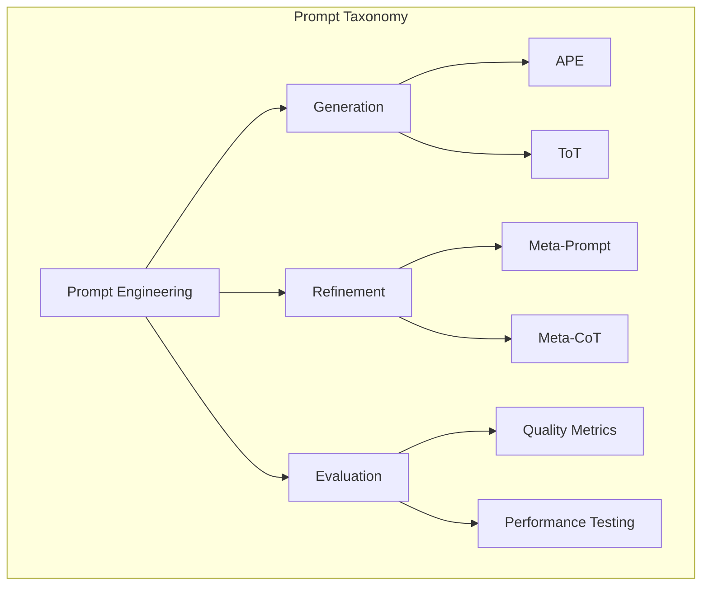
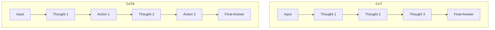
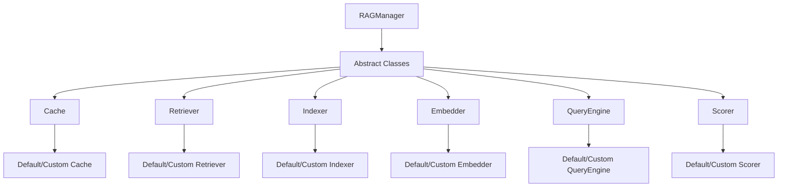
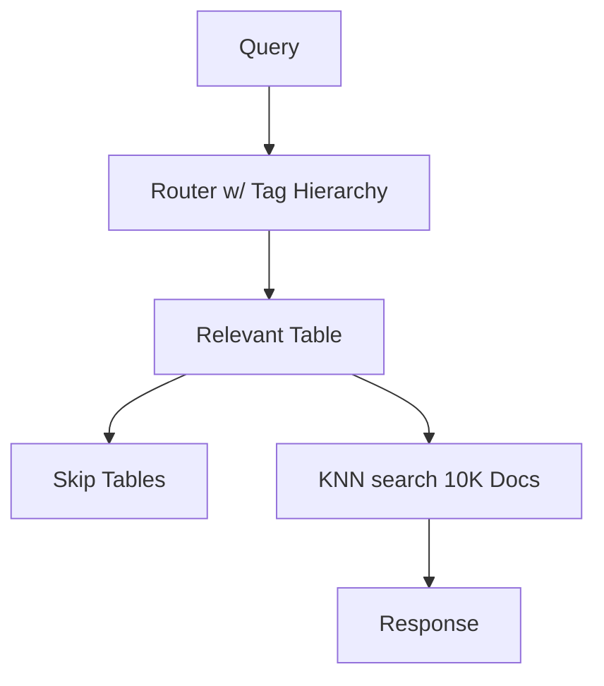
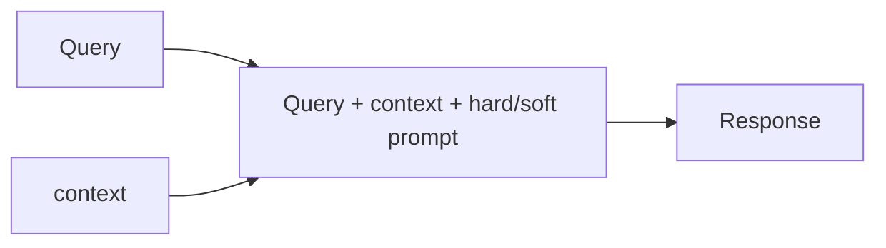

# CoTARAG v0.11.0 📊💭➡️⚙️

CoTARAG (Cognitive Thought and Retrieval Augmented Generation) is an advanced AI agent framework that combines two powerful engines:

1. **CoTAEngine**: A Chain-of-Thought-Action engine that combines Chain-of-Thought (CoT) with ReAct prompting
2. **AcceleRAG**: A high-performance RAG framework focused on speed, accuracy, and modularity

<p align="center">
  
</p>

## Why CoTARAG for Agentic AI? 

CoTARAG's unique power comes from the seamless integration of CoTAEngine and AcceleRAG, enabling the creation of arbitrarily complex agents at minimal cost:

### CoTAEngine: Transparent Reasoning
- **Thought-Action Pairs**: Clear separation of reasoning and execution
- **Chain-of-Thought-Actions**: Ability to chain together reasoning and execution units of arbitrary length.
- **Easy debugging**: CoTAEngine class contains tracks pipeline stages for easy debugging and transparent control flow

### AcceleRAG: Efficient Knowledge Access
- **Caching**: Dramatically reduce API costs w/ prompt caching (additional caching coming soon) 
- **Intelligent Routing**: Reduce search space by "routing" query to a small subset of most relevant data
- **Hallucination Control**: Built-in quality scoring + "grounding" to guard against undesirable outputs
- **Multi-modal Support**: Index and retrieve images as well as text, w/more modalities and cross-modal search coming soon!  

### Together: Powerful & Cost-Effective Agents
- **Cost Optimization**: 
  - Caching reduces API calls
  - Smart routing minimizes token usage
  - Efficient chunking reduces embedding costs
- **Complex Capabilities**:
  - Multi-step reasoning with full context
  - Knowledge-grounded decision making
  - Self-improving chains
  - Cross-modal understanding
- **Developer Benefits**:
  - Simple Python classes
  - Clear debugging
  - Flexible customization
  - Production-ready deployment

### Example: Research Assistant Agent
```python
# Combines CoTAEngine's reasoning with AcceleRAG's knowledge access
class ResearchAssistantAction(LLMThoughtAction):
    def thought(self, query):
        # Use AcceleRAG to find relevant research
        research = rag.retrieve(query, top_k=10)
        return f"Research this topic:\n{query}\n\nFound research:\n{research}"
    
    def action(self, thought_output):
        # Generate research summary and recommendations
        return rag.generate_response(
            query=f"Summarize findings and provide recommendations:\n{thought_output}",
            grounding='hard'
        )
```

This agent demonstrates how CoTARAG enables:
1. **Efficient Knowledge Access**: AcceleRAG finds relevant research
2. **Clear Reasoning**: CoTAEngine analyzes and synthesizes findings
3. **Cost Control**: Caching and smart routing minimize API usage
4. **Quality Control**: Built-in scoring + grounding ensures reliable outputs 


### Advanced Prompting Strategies

CoTAEngine subsumes several advanced prompting strategies through its flexible ThoughtAction interface:

#### Meta-Prompting
```python
class MetaPromptAction(LLMThoughtAction):
    def thought(self, prompt, goal):
        # Generate improved prompt for specific goal
        return f"This prompt is fed into OpenAI's o4 model - {prompt} - please improve it so that the o4 model output reaches this {goal}"
    
    def action(self, thought_output):
        # Execute the improved prompt
        return dotask(function(thought_output))
```

#### Tree-of-Thoughts (ToT)
```python
class TreeOfThoughtsAction(LLMThoughtAction):
    def thought(self, tot_description):
        # Generate reasoning tree structure
        return f"in a mermaid diagram generate a tree of reasoning steps that follow the ToT strategy: {tot_description}"
    
    def action(self, thought_output):
        # Convert LLM output to executable DAG
        return convert_llm_tot(thought_output)  # Returns series of function calls as DAG
```

#### Automated Prompt Engineering (APE)
```python
class APEAction(LLMThoughtAction):
    def thought(self, goals):
        # Generate effective prompts for given goals
        return f"generate a list of effective prompts that will be fed into OpenAI's o4 model that will help it reach the following goals: {goals}"
    
    def action(self, thought_output):
        # Save and evaluate prompts using PromptRefiner
        return PromptRefiner(thought_output)  # Automated prompt testing and refinement
```

#### Meta-CoT
```python
class MetaCoTAction(LLMThoughtAction):
    def thought(self, chain):
        # Analyze and refine reasoning chain
        return f"given this reasoning chain: {chain} - provide reasoning refinements for each stage along with an explanation for the change"
    
    def action(self, thought_output):
        # Apply refined reasoning chain
        return refined_chain(thought_output)  # Uses improved reasoning over original
```

Each strategy is implemented as a specialized ThoughtAction pair, demonstrating CoTAEngine's flexibility in handling various advanced prompting techniques while maintaining a consistent interface and clear separation between reasoning and action steps.

Please refer to the Jupyter notebooks for additional discussion & interactive tutorials!  

### Beyond Meta-Prompting: CoTA's Prompt Engineering Taxonomy

While Meta-Prompting is a powerful technique, it has inherent limitations:
- It relies on the same LLM for both refinement and execution
- The refinement process is opaque and difficult to debug
- There's no clear separation between prompt engineering and execution
- It lacks structured ways to evaluate and improve prompts

CoTAEngine addresses these limitations by providing a clear "prompt engineering taxonomy" through its ThoughtAction interface:



This taxonomy enables:
1. **Clear Separation of Concerns**
   - Generation: Creating new prompts (APE, ToT)
   - Refinement: Improving existing prompts (Meta-Prompt, Meta-CoT)
   - Evaluation: Testing and measuring prompt effectiveness

2. **Flexible Implementation**
   - Each component can use different LLMs or models
   - Easy to swap out or upgrade individual components
   - Clear interfaces for extending the taxonomy

3. **Structured Development**
   - Systematic approach to prompt engineering
   - Reusable components and patterns
   - Clear debugging and improvement paths

4. **Quality Control**
   - Built-in evaluation mechanisms
   - Performance metrics and testing
   - Continuous improvement feedback loops

This structured approach to prompt engineering makes it easier to:
- Debug and improve prompts systematically
- Reuse successful prompt patterns
- Measure and compare different strategies
- Build more complex prompt engineering pipelines


### CoT vs CoTA: Understanding the Difference



The key difference is that CoTA explicitly separates reasoning (thoughts) from actions, creating a more structured and debuggable chain. Each ThoughtAction pair:
1. First reasons about what to do (thought)
2. Then performs a concrete action based on that reasoning
3. Passes the result to the next ThoughtAction pair

### ThoughtAction Classes

The framework provides two main classes for building CoTA chains:

#### ThoughtAction
The base class that defines the interface for all thought-action pairs:
```python
class ThoughtAction:
    def thought(self, input_data):
        # Override this to implement the reasoning step
        pass
        
    def action(self, thought_output):
        # Override this to implement the action step
        pass
```

#### LLMThoughtAction
A specialized class that uses an LLM for the thought step:
```python
class LLMThoughtAction(ThoughtAction):
    def __init__(self, api_key=None, query_engine=None):
        # Uses Anthropic API by default
        self.query_engine = query_engine or AnthropicEngine(api_key=api_key)
    
    def thought(self, input_data):
        # Uses LLM to generate reasoning
        return self.query_engine.generate_response(input_data)
        
    def action(self, thought_output):
        # Override this to implement the action step
        pass
```

This separation allows for:
- Clear distinction between reasoning and action
- Easy debugging of each step
- Flexible implementation of different reasoning engines
- Consistent interface for all thought-action pairs

### Example Usage

```python
from cota_engine.cota_engine import CoTAEngine
from cota_engine.thought_action import LLMThoughtAction

# Define a thought-action for code analysis
class AnalyzeCodeAction(LLMThoughtAction):
    def action(self, thought_output):
        # Write analysis to file
        with open('code_analysis.txt', 'w') as f:
            f.write(thought_output)
        return thought_output

# Define a thought-action for suggesting improvements
class SuggestImprovementsAction(LLMThoughtAction):
    def action(self, thought_output):
        # Write suggestions to file
        with open('improvements.txt', 'w') as f:
            f.write(thought_output)
        return thought_output

# Create the CoTA chain
cota_engine = CoTAEngine([
    AnalyzeCodeAction(api_key='your_key'),
    SuggestImprovementsAction(api_key='your_key')
])

# Run the chain
input_text = "print('Hello, World!')"
cota_engine.run(input_text)

# The reasoning chain is automatically tracked
for step in cota_engine.reasoning_chain:
    print(f"Step: {step['query_engine']}")
    print(f"Thought: {step['thought_output']}")
    print(f"Action: {step['action_output']}")
```

## AcceleRAG Framework

A high-performance, production-ready RAG (Retrieval-Augmented Generation) framework focused on speed, accuracy, and modularity. AcceleRAG provides a fully operational text-based RAG pipeline with built-in prompt caching, and image modality support through a completely modular architecture.

### Framework Architecture



### Query Routing


### Grounding Modes


### Basic Usage

```python
from managers import RAGManager

# Initialize RAG manager
rag = RAGManager(
    api_key='path/to/api_key.txt',
    dir_to_idx='path/to/documents',
    grounding='soft',
    quality_thresh=8.0,
    enable_cache=True,
    use_cache=True,
    cache_thresh=0.9,
    logging_enabled=True
)

# Index documents
rag.index()

# Generate response with retrieval
response = rag.generate_response(
    query="Explain the key differences between RAG and traditional retrieval systems",
    use_cache=True,
    cache_thresh=0.9,
    grounding='hard',
    show_similarity=True
)
```

### Custom Component Implementation

#### Custom Indexer
```python
from indexers import Indexer

class CustomIndexer(Indexer):
    def index(self, corpus_dir, tag_hierarchy=None, **kwargs):
        # Custom chunking strategy
        chunks = self._custom_chunking(corpus_dir)
        
        # Custom metadata extraction
        metadata = self._extract_metadata(chunks)
        
        # Custom storage logic
        self._store_chunks(chunks, metadata)
        
        return {
            'num_chunks': len(chunks),
            'metadata': metadata
        }
    
    def _custom_chunking(self, corpus_dir):
        # Implement your chunking logic
        # Example: Semantic chunking based on content
        chunks = []
        for file in self._get_files(corpus_dir):
            content = self._read_file(file)
            chunks.extend(self._semantic_split(content))
        return chunks
    
    def _extract_metadata(self, chunks):
        # Implement custom metadata extraction
        # Example: Extract key topics, entities, etc.
        return {
            chunk_id: {
                'topics': self._extract_topics(chunk),
                'entities': self._extract_entities(chunk),
                'summary': self._generate_summary(chunk)
            }
            for chunk_id, chunk in enumerate(chunks)
        }

# Use in RAGManager
rag = RAGManager(
    api_key='your_key',
    dir_to_idx='docs',
    indexer=CustomIndexer()  # Drop in your custom indexer
)
```

#### Custom Retriever
```python
from retrievers import Retriever

class CustomRetriever(Retriever):
    def retrieve(self, query, top_k=5, **kwargs):
        # Implement hybrid search
        bm25_results = self._bm25_search(query)
        embedding_results = self._embedding_search(query)
        
        # Custom ranking logic
        ranked_results = self._rank_results(
            bm25_results,
            embedding_results,
            query
        )
        
        return ranked_results[:top_k]
    
    def _bm25_search(self, query):
        # Implement BM25 search
        # Example: Using rank_bm25 library
        return self.bm25.get_top_n(
            self.tokenizer.tokenize(query),
            self.documents,
            n=10
        )
    
    def _embedding_search(self, query):
        # Implement vector search
        # Example: Using FAISS
        query_vector = self.embedder.encode(query)
        return self.index.search(query_vector, k=10)
    
    def _rank_results(self, bm25_results, embedding_results, query):
        # Implement custom ranking
        # Example: Weighted combination of scores
        combined_results = self._merge_results(
            bm25_results,
            embedding_results
        )
        return self._rerank(combined_results, query)

# Use in RAGManager
rag = RAGManager(
    api_key='your_key',
    dir_to_idx='docs',
    retriever=CustomRetriever()  # Drop in your custom retriever
)
```

#### Custom Embedder
```python
from embedders import Embedder

class CustomEmbedder(Embedder):
    def embed(self, text, **kwargs):
        # Implement custom embedding logic
        # Example: Using a different model
        return self._model.encode(
            text,
            **kwargs
        )
    
    def _model_encode(self, text, **kwargs):
        # Custom preprocessing
        processed_text = self._preprocess(text)
        
        # Model-specific encoding
        return self.model(
            processed_text,
            **kwargs
        )
    
    def _preprocess(self, text):
        # Implement custom preprocessing
        # Example: Specialized text cleaning
        return self._clean_text(text)

# Use in RAGManager
rag = RAGManager(
    api_key='your_key',
    dir_to_idx='docs',
    embedder=CustomEmbedder()  # Drop in your custom embedder
)
```

#### Custom Query Engine
```python
from query_engines import QueryEngine

class CustomQueryEngine(QueryEngine):
    def generate_response(self, prompt, **kwargs):
        # Implement custom LLM integration
        # Example: Using a different LLM provider
        return self._llm.generate(
            prompt,
            **kwargs
        )
    
    def _llm_generate(self, prompt, **kwargs):
        # Custom prompt engineering
        enhanced_prompt = self._enhance_prompt(prompt)
        
        # Model-specific generation
        return self.llm.generate(
            enhanced_prompt,
            **kwargs
        )
    
    def _enhance_prompt(self, prompt):
        # Implement custom prompt engineering
        # Example: Adding system messages
        return self._add_system_message(prompt)

# Use in RAGManager
rag = RAGManager(
    api_key='your_key',
    dir_to_idx='docs',
    query_engine=CustomQueryEngine()  # Drop in your custom query engine
)
```

#### Custom Scorer
```python
from scorers import Scorer

class CustomScorer(Scorer):
    def score(self, response, context, query, **kwargs):
        # Implement custom scoring logic
        quality_score = self._evaluate_quality(response, context, query)
        hallucination_risk = self._assess_hallucination_risk(response, context)
        relevance_score = self._calculate_relevance(response, query)
        
        return {
            'quality_score': quality_score,
            'hallucination_risk': hallucination_risk,
            'relevance_score': relevance_score,
            'overall_score': self._calculate_overall_score(
                quality_score,
                hallucination_risk,
                relevance_score
            )
        }
    
    def _evaluate_quality(self, response, context, query):
        # Implement quality evaluation
        # Example: Using multiple metrics
        coherence = self._evaluate_coherence(response)
        completeness = self._evaluate_completeness(response, query)
        context_usage = self._evaluate_context_usage(response, context)
        
        return self._weighted_average({
            'coherence': coherence,
            'completeness': completeness,
            'context_usage': context_usage
        })
    
    def _assess_hallucination_risk(self, response, context):
        # Implement hallucination detection
        # Example: Using contradiction detection
        contradictions = self._detect_contradictions(response, context)
        unsupported = self._find_unsupported_claims(response, context)
        
        return self._calculate_risk_score(contradictions, unsupported)
    
    def _calculate_relevance(self, response, query):
        # Implement relevance scoring
        # Example: Using semantic similarity
        return self._semantic_similarity(response, query)
    
    def _calculate_overall_score(self, quality, risk, relevance):
        # Implement overall scoring
        # Example: Weighted combination
        weights = {
            'quality': 0.4,
            'risk': 0.3,
            'relevance': 0.3
        }
        
        return (
            quality * weights['quality'] +
            (10 - risk) * weights['risk'] +  # Convert risk to positive score
            relevance * weights['relevance']
        )

# Use in RAGManager
rag = RAGManager(
    api_key='your_key',
    dir_to_idx='docs',
    scorer=CustomScorer()  # Drop in your custom scorer
)
```

Each component can be swapped independently, allowing you to:
- Use different embedding models (ex. encoder-only transformers) 
- Implement custom retrieval strategies
- Add specialized indexing logic
- Integrate different LLM providers
- Customize scoring and evaluation

The framework handles all the component coordination, so you can focus on implementing your custom logic.

## Framework Comparisons

### AcceleRAG vs Other RAG Frameworks

| Feature | LangChain | LlamaIndex | RAGFlow | AcceleRAG |
|---------|-----------|------------|---------|-----------|
| **Architecture** | Complex abstractions | Monolithic | Basic modularity | Fully modular |
| **Performance** | Slow | Moderate | Basic | Optimized |
| **Caching** | Basic | Simple | None | Sophisticated 4-mode |
| **Embeddings** | Limited | Basic | None | Customizable |
| **Hallucination Control** | None | None | None | Hard/Soft grounding |
| **Query Routing** | Basic | None | Simple | Intelligent |
| **Vendor Lock-in** | High | Moderate | Low | None |
| **Production Ready** | Complex | Custom | Basic | Out-of-box |
| **Customization** | Limited | Basic | Moderate | Complete |

### CoTAEngine vs LangChain

| Feature | LangChain | CoTAEngine |
|---------|-----------|------------|
| **Transparency** | Limited visibility into chain internals | Full visibility of thought-action chain |
| **Performance** | High overhead from abstractions | Direct execution with minimal overhead |
| **Ease of Use** | Complex setup, many abstractions | Simple Python classes, clear flow |
| **Debugging** | Difficult to trace issues | Built-in chain tracking and logging |
| **Flexibility** | Rigid chain structure | Customizable thought-action pairs |
| **Documentation** | Complex, scattered | Clear, focused on chain building |

## Installation

```bash
pip install cotarag==0.10.0
```

## License

This project is licensed under the GNU Affero General Public License v3.0 - see the [LICENSE](LICENSE) file for details.


## Roadmap

- v0.11.0: PyPi publication
- v0.12.0: Docker image  
- v0.13.0: Flask Front-end playground
- v0.14.0: Cross-modal search
- v0.15.0: Agentic Indexers & Retrievers
- v0.16.0: Synthetic Dataset creation 
- v0.17.0: Benchmarks & Performance Testing
- v1.0.0: DSL for RAG pipelines + updated testing suite
- v1.1.0: Concurrency Framework for Multi-Agent Workflows
- v1.2.0: Agent Tasking DSL
- v1.3.0: Meta-Agent Framework
- v1.4.0: Rust Core Components

## Coming Features (subject to change)

### Upcoming Improvements

| Component | Feature | Description | Target Version |
|-----------|---------|-------------|----------------|
| **AcceleRAG** | Cross-modal Search | Unified search across text, image, and audio modalities | v0.14.0 |
| | Agentic Indexers | Self-optimizing document processing and metadata extraction | v0.15.0 |
| | Agentic Retrievers | DAG-based query planning and multi-hop retrieval | v0.15.0 |
| | Synthetic Dataset Creation | AI-powered dataset generation for training | v0.16.0 |
| | Benchmarks & Testing | Comprehensive performance evaluation suite | v0.17.0 |
| **CoTAEngine** | Multi-LLM Support | Seamless integration with multiple LLM providers | v0.11.0 |
| | Chain Visualization | Interactive visualization of thought-action chains | v0.12.0 |
| | Chain Optimization | Automatic optimization of chain structure | v0.13.0 |
| | Chain Templates | Pre-built templates for common use cases | v0.14.0 |
| | Chain Analytics | Detailed metrics and insights for chain performance | v0.15.0 |
| **Concurrency Framework** | Multi-Agent Orchestration | Parallel execution of agent workflows | v1.1.0 |
| | Resource Management | Smart allocation of computational resources | v1.1.0 |
| | State Management | Distributed state tracking across agents | v1.1.0 |
| | Error Recovery | Automatic handling of agent failures | v1.1.0 |
| **Agent Tasking DSL** | Query Translation | Convert natural language to structured tasks | v1.2.0 |
| | Task Planning | Automated task decomposition and scheduling | v1.2.0 |
| | Self-Improvement | Dynamic optimization of task execution | v1.2.0 |
| | Task Templates | Reusable task patterns and workflows | v1.2.0 |
| **Meta-Agent Framework** | Agent Composition | Create agents from other agents | v1.3.0 |
| | Agent Specialization | Dynamic role assignment and optimization | v1.3.0 |
| | Agent Evolution | Self-modifying agent architectures | v1.3.0 |
| | Agent Communication | Structured inter-agent messaging | v1.3.0 |
| **Rust Core** | Performance Optimization | High-performance core components | v1.4.0 |
| | Memory Safety | Guaranteed thread and memory safety | v1.4.0 |
| | FFI Integration | Seamless Python-Rust interop | v1.4.0 |
| | SIMD Acceleration | Vectorized operations for embeddings | v1.4.0 |


These new features will enable:
1. **Scalable Multi-Agent Systems**
   - Parallel execution of complex workflows
   - Efficient resource utilization
   - Robust error handling

2. **Intelligent Task Management**
   - Natural language to structured tasks
   - Automated planning and optimization
   - Self-improving execution

3. **Advanced Agent Architectures**
   - Composition of specialized agents
   - Dynamic role optimization
   - Self-modifying capabilities

4. **High-Performance Core**
   - Memory-safe concurrent operations
   - SIMD-accelerated computations
   - Seamless Python integration

## Continuous Integration (CI) Note

- OpenAI-based tests may fail due to connection timeouts. Focus on Anthropic and image RAG builds for CI reliability in the current version
