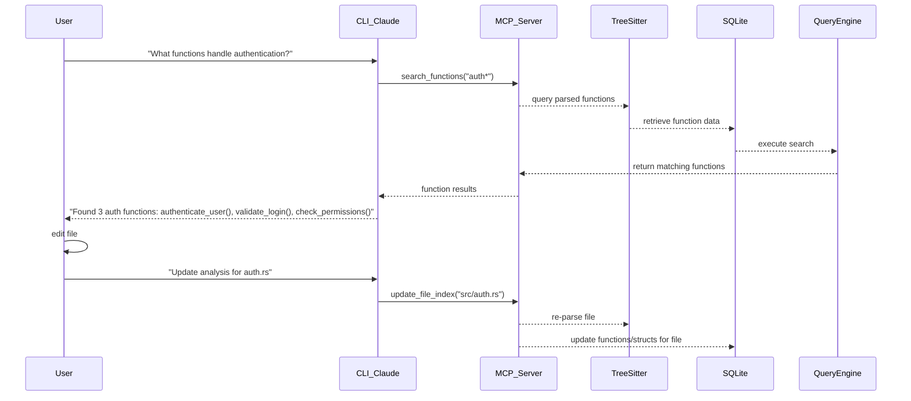

# Lightweight Code Analysis Server — PRD (v0.3)

*Version 0.3 "Tree-sitter + MCP + CLI + Multi-language Code Understanding"*  
*Author: Claude (code-understanding assistant)*  
*Date: January 2025*

---

## 1 · Purpose & Goals

| Goal | Why it matters |
|------|----------------|
| **Multi-language code structure analysis** using tree-sitter for function/struct/import extraction | Provides MCP-compatible agents with precise code understanding without hallucination |
| **Dual interface**: MCP server + interactive CLI chat | Serves both programmatic agent access and developer debugging workflows |
| **Real-time incremental updates** after file edits | Agent always has current repository state for next operation |
| **Project structure insight** via comprehensive repomap | Helps agents understand codebase organization and make informed placement decisions |
| **Dependency graph analysis** with import/export tracking | Enables impact analysis and refactoring assistance |
| **MCP server runs locally with zero external dependencies** | Core analysis engine works offline, fast, hackable, no API costs |

**Success metric:** ≤ 1s to analyze typical file. ≤ 10s full repository scan for 500 kLoC workspace. ≤ 200ms incremental updates.

**Architecture:** Local MCP server (zero dependencies) + CLI interface with Anthropic Claude for natural language interaction.

---

## 2 · High‑Level Workflow



---

## 3 · User Stories & Scenarios

1. **Function refactoring** → Developer asks CLI "Show me all callers of validate_user()". Claude calls MCP tools, shows call sites with context.  
2. **Add new feature** → Developer asks "What's the pattern for controllers?". Claude explores via MCP, analyzes existing controllers, explains patterns.  
3. **Dependency analysis** → Developer asks "What would break if I change User struct?". Claude uses dependency analysis tools to show impact.
4. **Code exploration** → Developer asks "Show me async functions in the database layer". Claude searches and presents with explanations.
5. **API discovery** → Developer asks "What public functions are available?". Claude searches and categorizes by module.

---

## 4 · Feature Scope (MVP)

| Feature | Must? | Notes |
|---------|-------|-------|
| Tree-sitter multi-language parsing | ✔ | Rust, Python, TypeScript, JavaScript, Go support |
| Function signature extraction | ✔ | Name, parameters, return type, visibility, async detection |
| Struct/class analysis | ✔ | Fields, methods, inheritance relationships |
| Import/export mapping | ✔ | Full dependency graph construction |
| Incremental file updates | ✔ | Re-parse only changed files, diff-based updates |
| SQLite metadata storage | ✔ | `files`, `functions`, `structs`, `imports` tables |
| MCP server interface | ✔ | Tools + resources for agent integration (zero dependencies) |
| CLI with Anthropic Claude | ✔ | Natural language interface using MCP tools |
| Repository mapping | ✔ | Project structure with ignore patterns |
| Pattern-based search | ✔ | Regex and name-based function/struct search |
| Dependency analysis | ✔ | Import chains and usage tracking |
| Language auto-detection | ✔ | File extension + content-based detection |
| Parallel processing | ✔ | Multi-threaded file analysis |
| Error recovery | ✔ | Graceful handling of parse failures |
| Configuration system | ✔ | Include/exclude patterns, language settings |
| Semantic search | ✖ | Out of scope - pure structural analysis |
| Vector embeddings | ✖ | Out of scope - no AI/ML dependencies in MCP server |
| Code completion | ✖ | Future work |
| Git integration | ✖ | Future work |

---

## 5 · MCP Interface Contract

### **Tools:**
| Tool Name | Description | Parameters |
|-----------|-------------|------------|
| `scan_repository` | Build complete repository analysis | `path`, `include_patterns[]`, `exclude_patterns[]` |
| `analyze_file` | Single file detailed analysis | `file_path` |
| `search_functions` | Find functions by pattern/name | `pattern`, `scope`, `filters` |
| `search_structs` | Find structs/classes by pattern | `pattern`, `include_fields` |
| `get_dependencies` | File dependency analysis | `file_path`, `depth`, `direction` (incoming/outgoing) |
| `get_imports` | List imports for file/module | `file_path`, `include_external` |
| `get_exports` | List exports from file/module | `file_path` |
| `update_file_index` | Re-index single file after edit | `file_path` |
| `get_function_calls` | Find all calls to specific function | `function_name`, `scope` |
| `get_repo_metrics` | Repository statistics | `include_complexity` |

### **Resources:**
| URI Pattern | Description | Parameters |
|-------------|-------------|------------|
| `mcp://repo/map` | Complete repository structure | `depth` (default 3), `show_hidden` |
| `mcp://repo/files` | List all analyzed files | `language_filter`, `pattern` |
| `mcp://repo/file/{path}` | Detailed file analysis | — |
| `mcp://repo/function/{name}` | Function signature and location | `scope` (file/repo) |
| `mcp://repo/struct/{name}` | Struct definition and usage | `include_methods` |
| `mcp://repo/dependencies/{path}` | File dependency graph | `depth` |

### **Subscriptions:**
| Event | Description | Payload |
|-------|-------------|---------|
| `file_analyzed` | File analysis completed | `{file_path, functions_count, structs_count, duration_ms}` |
| `analysis_error` | File analysis failed | `{file_path, error, language}` |
| `repository_updated` | Full repository scan completed | `{files_count, total_functions, languages[]}` |

---

## 6 · CLI Interface

### **Interactive Natural Language Chat:**
```bash
# Start CLI in current directory
$ loregrep chat

🔍 Scanning repository... 
📊 Found 45 files | 234 functions | 67 structs | Languages: [rust, python, typescript]
🗺️ Repository analysis complete!

💬 Chat with your codebase (powered by Claude + local analysis):

> What functions handle authentication?
🔍 Found 3 functions related to authentication:
  • pub async fn authenticate_user(token: &str) -> Result<User, AuthError>
  • pub fn validate_token(token: &str) -> bool  
  • fn hash_password(password: &str) -> String

> Show me the User struct and explain its purpose
📋 struct User {
  • id: u64
  • email: String  
  • created_at: DateTime<Utc>
  • is_active: bool
}
Located in: src/models/user.rs:15

The User struct represents a user account in your system. It includes:
- Unique identifier (id)
- Email for authentication
- Account creation timestamp
- Active status flag for account management

> What would break if I change the User struct?
🔗 Impact Analysis for User struct:
Direct impacts (3 files):
  • src/auth.rs - authenticate_user() function uses User
  • src/handlers/user.rs - CRUD operations depend on User fields
  • src/database/user_queries.rs - SQL queries reference User fields

Potential risks:
  • High: Database migration needed if fields change
  • Medium: Authentication flow may need updates
  • Low: API responses may need versioning

> /help
Available commands:
  /scan [path] - Re-scan directory
  /analyze <file> - Analyze specific file  
  /deps <file> - Show dependencies
  /map - Show repository structure
  /config - Show settings
```

### **Architecture:**
- **MCP Server**: Runs locally, zero external dependencies, provides code analysis tools
- **CLI Interface**: Uses Anthropic Claude API to provide natural language interaction
- **Tool Integration**: Claude calls MCP tools (search_functions, get_dependencies, etc.) to answer queries
- **Offline Core**: All code analysis happens locally, only natural language processing requires API

---

## 7 · Non‑Functional Requirements

| KPI | Target |
|-----|--------|
| **File analysis latency** | ≤ 100ms for typical source file |
| **Repository scan time** | ≤ 10s for 100 kLoC / ≤ 30s for 500 kLoC |
| **Incremental update** | ≤ 200ms per file re-analysis |
| **Memory footprint** | ≤ 500MB for 500 kLoC repository |
| **Storage efficiency** | ≤ 10MB SQLite database for 100 kLoC |
| **Language accuracy** | ≥ 99% correct function/struct extraction |
| **Concurrency** | Support 4+ parallel file analysis |
| **Error tolerance** | Continue analysis despite individual file parse errors |

---

## 8 · System Architecture

```
┌─────────────────────────────────────────────────────────────────┐
│                   Local Code Analysis Server                    │
│                     (Zero External Dependencies)                │
│                                                                 │
│  ┌─────────────────┐  ┌─────────────────┐  ┌─────────────────┐ │
│  │ Language        │  │ Query Engine    │  │ Repository      │ │
│  │ Analyzers       │  │                 │  │ Scanner         │ │
│  │ • RustAnalyzer  │  │ • Pattern Match │  │ • File Discovery│ │
│  │ • PythonAnalyzer│  │ • Dependency    │  │ • Change Detect │ │
│  │ • TypeScript... │  │ • Metrics       │  │ • Incremental   │ │
│  └─────────────────┘  └─────────────────┘  └─────────────────┘ │
│                                │                                │
│  ┌─────────────────────────────┴──────────────────────────────┐ │
│  │              Tree-sitter Parsing Core                    │ │
│  │          • Multi-language grammar support                │ │
│  │          • AST traversal and extraction                  │ │
│  └──────────────────────────────────────────────────────────┘ │
│                                │                                │
│  ┌─────────────────────────────┴──────────────────────────────┐ │
│  │                SQLite Metadata Store                     │ │
│  │    • files    • functions    • structs    • imports      │ │
│  └──────────────────────────────────────────────────────────┘ │
└─────────────────────────────────────────────────────────────────┘
                              │
                 ┌────────────┴────────────┐
                 │                         │
      ┌─────────────────┐        ┌─────────────────┐
      │   MCP Server    │        │ CLI Interface   │
      │   (Offline)     │        │ (Claude API)    │
      │                 │        │                 │
      │ • Tools         │        │ • Natural Lang  │
      │ • Resources     │        │ • Conversation  │
      │ • Events        │        │ • MCP Client    │
      └─────────────────┘        └─────────────────┘
              │                           │
  ┌─────────────────┐           ┌─────────────────┐
  │ LLM Agents      │           │ Developers      │
  │ • Claude        │           │ • Code Review   │
  │ • GPT           │           │ • Exploration   │
  │ • Local Models  │           │ • Debugging     │
  └─────────────────┘           └─────────────────┘
```

---

## 9 · Database Schema

```sql
-- Repository metadata
CREATE TABLE repositories (
    id INTEGER PRIMARY KEY,
    path TEXT UNIQUE NOT NULL,
    last_scan TIMESTAMP,
    file_count INTEGER,
    total_functions INTEGER,
    languages TEXT -- JSON array
);

-- File tracking
CREATE TABLE files (
    id INTEGER PRIMARY KEY,
    repo_id INTEGER REFERENCES repositories(id),
    path TEXT NOT NULL,
    language TEXT NOT NULL,
    content_hash TEXT NOT NULL,
    last_modified TIMESTAMP,
    parse_success BOOLEAN,
    functions_count INTEGER,
    structs_count INTEGER,
    imports_count INTEGER
);

-- Function signatures
CREATE TABLE functions (
    id INTEGER PRIMARY KEY,
    file_id INTEGER REFERENCES files(id),
    name TEXT NOT NULL,
    parameters TEXT, -- JSON array of "name: type"
    return_type TEXT,
    is_public BOOLEAN,
    is_async BOOLEAN,
    start_line INTEGER,
    end_line INTEGER,
    signature_hash TEXT
);

-- Struct/class definitions
CREATE TABLE structs (
    id INTEGER PRIMARY KEY,
    file_id INTEGER REFERENCES files(id),
    name TEXT NOT NULL,
    fields TEXT, -- JSON array of fields
    is_public BOOLEAN,
    start_line INTEGER,
    end_line INTEGER
);

-- Import/export relationships
CREATE TABLE imports (
    id INTEGER PRIMARY KEY,
    file_id INTEGER REFERENCES files(id),
    import_path TEXT NOT NULL,
    import_type TEXT, -- 'module', 'function', 'struct', etc.
    alias TEXT,
    is_external BOOLEAN
);

-- Function call relationships
CREATE TABLE function_calls (
    id INTEGER PRIMARY KEY,
    caller_file_id INTEGER REFERENCES files(id),
    caller_function TEXT,
    called_function TEXT,
    called_file_id INTEGER REFERENCES files(id),
    line_number INTEGER
);
```

---

## 10 · Milestones & Timeline

| Week | Deliverable |
|------|-------------|
| **W1** | Project restructuring + multi-language analyzer trait system |
| **W2** | Tree-sitter integration + RustAnalyzer + PythonAnalyzer + SQLite schema |
| **W3** | TypeScript + JavaScript analyzers + repository scanner |
| **W4** | Query engine + pattern matching + dependency analysis |
| **W5** | MCP server implementation + tool definitions |
| **W6** | CLI interface + interactive commands + pretty output |
| **W7** | Incremental updates + performance optimization |
| **W8** | Testing + documentation + v0.3 release |

---

## 11 · Success Metrics

* **Agent integration** under **1 min** (MCP server discovery + repository scan).  
* **≥ 99%** function/struct extraction accuracy across supported languages.  
* **Real-time updates:** Agent sees changes immediately after file edit.
* **Developer adoption:** CLI provides value for code exploration and debugging.
* Performance KPIs met on M2 laptop *and* 4‑core Linux VM.

---

## 12 · Risks & Mitigations

| Risk | Impact | Mitigation |
|------|--------|------------|
| Tree-sitter parse failures | Missing code elements | Graceful error handling + fallback strategies |
| Large repository performance | Slow initial scans | Parallel processing + smart caching |
| Language grammar limitations | Incomplete extraction | Conservative extraction + manual overrides |
| Memory usage for large repos | Server crashes | Streaming analysis + garbage collection |
| MCP adoption complexity | Agent integration friction | Comprehensive docs + examples |
| CLI UX complexity | Poor developer experience | Iterative UX testing + simple defaults |

---

## 13 · Implementation Details

### **Language Analyzer Architecture:**
```rust
pub trait LanguageAnalyzer: Send + Sync {
    fn language(&self) -> &'static str;
    fn file_extensions(&self) -> &[&'static str];
    fn analyze_file(&self, content: &str) -> Result<TreeNode>;
    fn extract_functions(&self, tree: &Tree) -> Vec<FunctionSignature>;
    fn extract_structs(&self, tree: &Tree) -> Vec<StructSignature>;
    fn extract_imports(&self, tree: &Tree) -> Vec<ImportStatement>;
}

pub struct TreeNode {
    pub file_path: String,
    pub language: String,
    pub functions: Vec<FunctionSignature>,
    pub structs: Vec<StructSignature>, 
    pub imports: Vec<ImportStatement>,
    pub exports: Vec<ExportStatement>,
    pub parse_errors: Vec<ParseError>,
}
```

### **Incremental Update Strategy:**
```rust
pub fn update_file_index(file_path: &str) -> Result<UpdateResult> {
    let current_hash = calculate_file_hash(file_path)?;
    let stored_hash = db.get_file_hash(file_path)?;
    
    if current_hash == stored_hash {
        return Ok(UpdateResult::NoChange);
    }
    
    // Re-analyze file
    let analyzer = get_analyzer_for_file(file_path)?;
    let tree_node = analyzer.analyze_file(&fs::read_to_string(file_path)?)?;
    
    // Update database
    db.transaction(|tx| {
        tx.delete_file_data(file_path)?;
        tx.insert_file_data(&tree_node)?;
        tx.update_file_hash(file_path, current_hash)?;
        Ok(())
    })?;
    
    Ok(UpdateResult::Updated {
        functions_added: tree_node.functions.len(),
        structs_added: tree_node.structs.len(),
    })
}
```

---

### Appendix A · Language Support Matrix

| Language | Status | Functions | Structs/Classes | Imports | Exports | Async Detection |
|----------|--------|-----------|-----------------|---------|---------|-----------------|
| **Rust** | ✅ MVP | ✅ | ✅ | ✅ | ✅ | ✅ |
| **Python** | ✅ MVP | ✅ | ✅ | ✅ | ✅ | ✅ |
| **TypeScript** | ✅ MVP | ✅ | ✅ | ✅ | ✅ | ✅ |
| **JavaScript** | ✅ MVP | ✅ | ✅ | ✅ | ✅ | ✅ |
| **Go** | ✅ MVP | ✅ | ✅ | ✅ | ✅ | ❌ |
| **Java** | 🟡 v0.4 | ✅ | ✅ | ✅ | ❌ | ❌ |
| **C++** | 🟡 v0.4 | ✅ | ✅ | ✅ | ❌ | ❌ |
| **C#** | 🟡 v0.5 | ✅ | ✅ | ✅ | ✅ | ✅ |

### Appendix B · Default Configuration

```toml
[repository]
max_file_size_mb = 10
max_files = 10000
parallel_workers = 4

[languages]
rust = { enabled = true, extensions = ["rs"] }
python = { enabled = true, extensions = ["py", "pyi"] }
typescript = { enabled = true, extensions = ["ts", "tsx"] }
javascript = { enabled = true, extensions = ["js", "jsx", "mjs"] }
go = { enabled = true, extensions = ["go"] }

[ignore_patterns]
directories = [
    "node_modules", "target", "dist", "build", ".git", 
    "__pycache__", ".pytest_cache", "vendor"
]
files = ["*.min.js", "*.bundle.js", "*.lock", "*.log"]

[mcp]
host = "localhost"
port = 3000
max_request_size_mb = 50

[cli]
provider = "anthropic"
api_key = "${ANTHROPIC_API_KEY}"
model = "claude-3-5-sonnet-20241022"
max_tokens = 4096
temperature = 0.1
auto_scan = true
colors = true
max_results = 50
```

---
