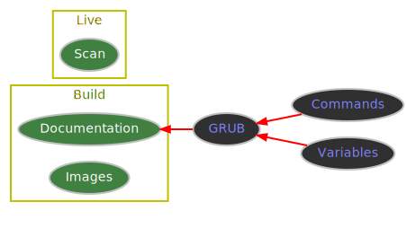

# Live Scan Grub Menu

Build an ESP File System including:
* standalone EFI & BIOS GRUB images
* boot time dynamic GRUB menu

## Dependencies

* grub-common
  * grub-mkimage
* grub-efi-amd64-bin
  * x86_64-efi
* grub-efi-amd64-signed
  * grubx64.efi.signed
* grub-pc-bin
  * i386-pc
    * boot.img
    * grub-bios-setup
* shim-signed
  * shimx64.efi.signed

* grub-theme-breeze
  * themes/breeze
* grub-theme-starfield
  * themes/starfield

## Project

```
├── __init__.py
├── __main__.py
├── build.mod
├── build.sh
├── doc.py
├── esp.py
├── grub.cfg.sh
├── grubx64.efi.signed.sh
├── images
│  └── nightly.png
├── license.md
├── live
│  ├── menu
│  │  ├── cmd.sh
│  │  ├── env.sh
│  │  ├── gfx.sh
│  │  ├── main.sh
│  │  ├── pause.sh
│  │  ├── scan.sh
│  │  ├── set.sh
│  │  └── static.sh
│  └── source
│     ├── boot.sh
│     ├── env.sh
│     ├── menu.sh
│     ├── probe.sh
│     ├── scan.sh
│     ├── sys.sh
│     └── util.sh
├── readme
│  └── grub.md
├── readme.md
├── todo.gv
└── todo.svg
```

## Usage

### build

```
build.sh pgp_fingerprint /esp/mount/point [/data/mount/point]
```

#### example

```
/rwx/lsgm/build.sh 9C7613450C80C24F /media/ssd/esp /media/ssd/data
```

#### output

```
├── bios
│  ├── boot.img
│  ├── core.img
│  └── setup.sh
├── boot
│  ├── grub
│  │  ├── fonts
│  │  │  └── *.pf2
│  │  ├── grub.cfg
│  │  ├── grub.pgp
│  │  ├── grubenv
│  │  ├── i386-pc
│  │  │  ├── *.lst
│  │  │  └── *.mod
│  │  ├── locale
│  │  │  └── *.mo
│  │  ├── themes
│  │  │  ├── breeze
│  │  │  │  ├── theme.txt
│  │  │  │  ├── *.pf2
│  │  │  │  ├── *.pf2.license
│  │  │  │  ├── *.png
│  │  │  │  └── *.png.license
│  │  │  └── starfield
│  │  │     ├── README
│  │  │     ├── theme.txt
│  │  │     ├── *.pf2
│  │  │     ├── *.pf2.license
│  │  │     ├── *.png
│  │  │     └── *.png.license
│  │  └── x86_64-efi
│  │     ├── *.lst
│  │     └── *.mod
│  └── lsgm
│     ├── menu
│     │  ├── cmd.sh
│     │  ├── env.sh
│     │  ├── gfx.sh
│     │  ├── main.sh
│     │  ├── pause.sh
│     │  ├── scan.sh
│     │  ├── set.sh
│     │  └── static.sh
│     └── source
│        ├── boot.sh
│        ├── env.sh
│        ├── menu.sh
│        ├── probe.sh
│        ├── scan.sh
│        ├── sys.sh
│        └── util.sh
├── efi
│  └── boot
│     ├── bootx64.efi
│     ├── core.efi
│     └── grubx64.efi
└── grub.env
```

### setup

```
setup.sh /dev/device
```

* example:

```
bash /media/ssd/esp/bios/setup.sh /dev/sda
```

## Roadmap



### BASH

#### build

* [ ] make custom

  * [ ] fonts
  * [ ] keyboard layouts

* [ ] make images

  * [ ] mimic grubx64.efi.signed
  * [ ] targets

    * [ ] arm
    * [x] i386-pc
    * [x] x86_64-efi
    * [x] x86_64-efi-signed

  * [ ] embed extra

    * [ ] fonts
    * [ ] keyboard layouts
    * [ ] locales

* [x] copy

  * [x] fonts
  * [x] locales
  * [x] themes

* [x] sign files
* [ ] setup bios

  * [x] write for manual call

    * [x] boot image
    * [x] core image
    * [x] setup script

  * [ ] auto

    * [ ] find esp device
    * [ ] write bios_grub partition

#### live

* [x] check signatures
* [ ] options

  * [x] check signatures for *.squashfs
  * [x] boot to ram
  * [ ] locales
  * [ ] themes

* [ ] target specific live-media

  * [ ] try -mount-opts

* refactor grub list_{const,vars,xtra} & split
* setparams probe_unset & smbios_unset

### Python

…
