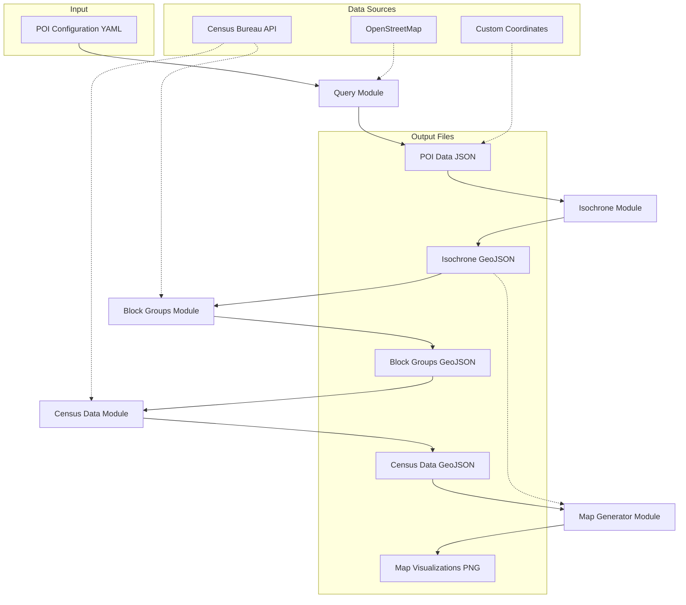

# Technical Documentation: SocialMapper

This document provides a detailed technical overview of the SocialMapper project, including its system architecture, module descriptions, and references for census data sources. Use this as a reference for development, extension, or integration.

## System Architecture

The SocialMapper follows a pipeline architecture where each component builds on the output of the previous one. Here's a diagram showing the data flow:

## Module Descriptions

1. **Query Module** (`src/query.py`):
   - Inputs: POI configuration (YAML)
   - Process: Builds and executes Overpass API queries to OpenStreetMap
   - Outputs: POI data (JSON)
   - Key Functions: `load_poi_config()`, `build_overpass_query()`, `query_overpass()`, `format_results()`

2. **Isochrone Module** (`src/isochrone.py`):
   - Inputs: POI data (either from Query Module or custom coordinates)
   - Process: Builds road network graphs and calculates areas reachable within specified travel times
   - Outputs: Isochrone polygons (GeoJSON)
   - Key Functions: `create_isochrone_from_poi()`, `create_isochrones_from_poi_list()`

3. **Block Groups Module** (`src/blockgroups.py`):
   - Inputs: Isochrone polygons, State FIPS codes
   - Process: Identifies census block groups that intersect with isochrones
   - Outputs: Block group geometries (GeoJSON)
   - Key Functions: `get_census_block_groups()`, `isochrone_to_block_groups()`

4. **Census Data Module** (`src/census_data.py`):
   - Inputs: Block group geometries, Census variable codes
   - Process: Fetches demographic data from Census API for identified block groups
   - Outputs: Block groups with census data (GeoJSON)
   - Key Functions: `get_census_data_for_block_groups()`, `merge_census_data()`

5. **Map Generator Module** (`src/map_generator.py`):
   - Inputs: Block groups with census data, Variable codes to visualize
   - Process: Creates choropleth maps for each selected census variable
   - Outputs: Map visualizations (PNG)
   - Key Functions: `generate_map()`, `generate_maps_for_variables()`

## Census References

1. https://tigerweb.geo.census.gov/tigerwebmain/TIGERweb_restmapservice.html
2. https://developers.arcgis.com/rest/ 